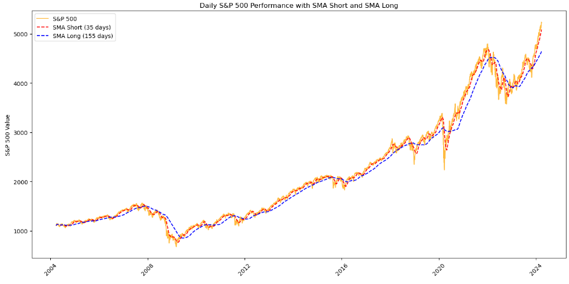

# S&P 500 Trading Strategy Optimization Project
## Authors ✨

- **Jan Cichocki** - *Contributor*
- **Bertrand Bading** - *Contributor*
- **Krashawn Ray-el** - *Contributor*

As a collective passionate about financial markets, we recognize the S&P 500 as a key barometer of the performance of 500 major companies listed on stock exchanges in the United States. Our project aims to explore and refine trading strategies that leverage this index, enhancing our understanding and effectiveness in market engagement.

[Check out our Main Python File!](https://github.com/jancichocki/Project_2/blob/main/main.ipynb)

## The Significance of the S&P 500

### A Comprehensive Market Snapshot
The S&P 500 provides a broad and diverse look at the U.S. economy through its inclusion of companies from all sectors. This diversity makes it an invaluable tool for gauging overall market sentiment and economic health.

### Benchmark for Performance
For individual investors and financial professionals alike, the S&P 500 serves as a critical benchmark. Assessing an investment's performance against this index helps in understanding its relative success or failure in the broader market context.

### Liquidity and Investment Vehicle
Due to its widespread acceptance and use, the S&P 500 benefits from high liquidity. This liquidity ensures tight bid-ask spreads and allows for large transactions without significantly impacting the price, facilitating smoother entry and exit for traders and investors.

## Leveraging the S&P 500 Through Futures

### Access to Leverage
Futures markets related to the S&P 500 offer traders the ability to leverage, amplifying their investment's potential returns. While leverage increases risk, it also opens up opportunities for significant gains from relatively small market movements.

### Hedging Opportunities
Futures can serve as a hedge against portfolio losses in volatile markets. By taking positions in S&P 500 futures, investors can protect themselves against downturns in the broader market, securing their investments against unforeseen drops.

### Market Accessibility
S&P 500 futures markets operate nearly 24/7, providing flexibility and accessibility that's not always available in traditional stock markets. This round-the-clock trading allows investors to react quickly to global economic news and events, making it an invaluable tool for those looking to stay ahead in a fast-paced market.

## In-depth Exploration of Key Points

### Simple Moving Averages (SMA) 📈

Our journey began with the exploration of Simple Moving Averages (SMA) as a cornerstone of our trading strategy. By analyzing the S&P 500 with varied SMA time windows, we ventured into smoothing out price data, aiming to distill the essence of market trends over specific periods. 

The essence of SMA lies in its simplicity and robustness. It calculates the average price of the stock over a predetermined number of days, offering a clear view of the underlying trend devoid of daily price fluctuations. This clarity is invaluable in deciphering the direction in which the market is moving.

We meticulously iterated through numerous combinations of short and long SMA periods. This exploration was not haphazard; each iteration was methodically calculated within a loop, ensuring a comprehensive assessment of every potential configuration. The AdaBoost classifier then came into play, a powerful tool that allowed us to evaluate the efficacy of each SMA combination systematically. Through this rigorous analysis, we discovered that SMAs, particularly when thoughtfully paired, serve as a more reliable indicator, laying a solid foundation for aggressive positioning in the market.

### Relative Strength Index (RSI) 🔍

Parallel to our exploration of SMAs was our investigation into the Relative Strength Index (RSI), a momentum oscillator that has stood the test of time. RSI's ability to measure the velocity and magnitude of price movements renders it an indispensable tool in our arsenal, especially in identifying the market's overbought or oversold conditions.

Our foray into RSI was not merely about its calculation; we delved deeper, examining the slope of the RSI over recent periods. This nuanced approach provided us with a lens through which to view the momentum underlying the S&P 500's movements. It's this momentum — the force propelling the market — that often signals the optimal moments for entry or exit.

### Synergy Between SMA and RSI 🤝

Through our in-depth analysis, we uncovered a compelling synergy between SMA and RSI. While SMA offered us a reliable framework for understanding market trends, RSI brought to light the optimal timings for capitalizing on market volatility. This combination, fortified by the AdaBoost classifier's precision, armed us with a strategy not just for navigating the market but for mastering its ebbs and flows.

Our findings underscore the efficacy of SMA as the bedrock of our strategy, advocating for a more aggressive positioning when corroborated by SMA trends. Concurrently, RSI serves as a dynamic complement, fine-tuning our approach by pinpointing the most auspicious moments to act amidst market volatility.

In synthesizing these indicators, we've charted a path to informed, strategic decision-making in the financial markets. Our project is a testament to the power of blending traditional indicators with cutting-edge machine learning techniques, paving the way for future explorations into the art and science of trading.

## Findings

### Simple Moving Averages (SMA) 📈

Explanation...

### Simple Moving Averages (SMA) With RSI Signals 📈

### Simple Moving Averages (SMA) With RSI Signals 📈

## Conclusion 🎉

Throughout this journey, our collective efforts have been dedicated to demystifying the complexities of trading strategies using the S&P 500 as our foundational metric. By employing a systematic approach to analyze Simple Moving Averages (SMA) and the Relative Strength Index (RSI), we've uncovered insights that refine our understanding of market dynamics. The utilization of the AdaBoost classifier further enhanced our strategy, enabling us to pinpoint the most effective combinations with precision.

Our exploration underscores the S&P 500's pivotal role in the financial ecosystem — serving not only as a mirror reflecting the multifaceted nature of the U.S. economy but also as a beacon guiding investment strategies. The liquidity and leverage opportunities it presents, coupled with the protective hedge it offers against market volatilities through futures trading, reaffirm its standing as an indispensable asset in any investor's portfolio.

*Happy Trading!*
