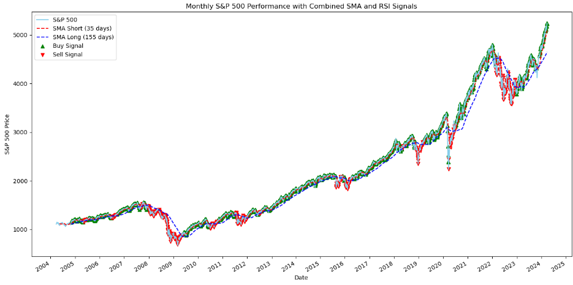

# S&P 500 Trading Strategy Optimization Project
## Authors ✨

- **Jan Cichocki** - *Contributor*
- **Bertrand Bading** - *Contributor*
- **Krashawn Ray-el** - *Contributor*

As a collective passionate about financial markets, we recognize the S&P 500 as a key barometer of the performance of 500 major companies listed on stock exchanges in the United States. Our project aims to explore and refine trading strategies that leverage this index, enhancing our understanding and effectiveness in market engagement.

[Check out our Main Python File!](https://github.com/jancichocki/Project_2/blob/main/main.ipynb)

## Executive Summary

In this project, our team embarked on an ambitious endeavor to optimize trading strategies using the S&P 500 index as our focal point. Our aim was to leverage technical analysis indicators, namely the Simple Moving Average (SMA) and the Relative Strength Index (RSI), to develop a nuanced understanding of market trends and dynamics. The project is rooted in our collective passion for financial markets and our commitment to harnessing machine learning to enhance trading effectiveness.

### **Project Overview**

The core of our project involved:
- **Data Analysis**: Utilizing `yfinance` to extract 20 years of S&P 500 daily data, providing a rich dataset for analysis.
- **SMA Strategy Optimization**: Through iterative testing, we identified optimal short and long SMA windows that serve as indicators for buy/sell signals, utilizing the AdaBoostClassifier for model training and evaluation.
- **RSI Integration**: We incorporated RSI to our strategy, analyzing its slope for additional momentum insights, thereby refining our trading signals further.
- **Visual Representation**: A comprehensive graphical analysis was conducted to visualize the effectiveness of our optimized SMA strategy, complemented by RSI insights, in navigating the S&P 500.

### **Key Findings**

Our findings reveal that:
- **SMA Crossover**: The SMA crossover strategy, when optimized, can serve as a robust indicator for generating trading signals.
- **RSI Value**: The incorporation of RSI, particularly its slope, enhances the signal strategy by providing momentum-based insights, allowing for more informed trading decisions.
- **Machine Learning Efficacy**: The application of the AdaBoostClassifier significantly contributes to the refinement of the trading strategy, underscoring the value of machine learning in financial analysis.

## The Significance of the S&P 500

### A Comprehensive Market Snapshot
The S&P 500 provides a broad and diverse look at the U.S. economy through its inclusion of companies from all sectors. This diversity makes it an invaluable tool for gauging overall market sentiment and economic health.

### Benchmark for Performance
For individual investors and financial professionals alike, the S&P 500 serves as a critical benchmark. Assessing an investment's performance against this index helps in understanding its relative success or failure in the broader market context.

### Liquidity and Investment Vehicle
Due to its widespread acceptance and use, the S&P 500 benefits from high liquidity. This liquidity ensures tight bid-ask spreads and allows for large transactions without significantly impacting the price, facilitating smoother entry and exit for traders and investors.

## Leveraging the S&P 500 Through Futures

### Access to Leverage
Futures markets related to the S&P 500 offer traders the ability to leverage, amplifying their investment's potential returns. While leverage increases risk, it also opens up opportunities for significant gains from relatively small market movements.

### Hedging Opportunities
Futures can serve as a hedge against portfolio losses in volatile markets. By taking positions in S&P 500 futures, investors can protect themselves against downturns in the broader market, securing their investments against unforeseen drops.

### Market Accessibility
S&P 500 futures markets operate nearly 24/7, providing flexibility and accessibility that's not always available in traditional stock markets. This round-the-clock trading allows investors to react quickly to global economic news and events, making it an invaluable tool for those looking to stay ahead in a fast-paced market.

## In-depth Exploration of Key Points

### Simple Moving Averages (SMA) 📈

Our journey began with the exploration of Simple Moving Averages (SMA) as a cornerstone of our trading strategy. By analyzing the S&P 500 with varied SMA time windows, we ventured into smoothing out price data, aiming to distill the essence of market trends over specific periods. 

The essence of SMA lies in its simplicity and robustness. It calculates the average price of the stock over a predetermined number of days, offering a clear view of the underlying trend devoid of daily price fluctuations. This clarity is invaluable in deciphering the direction in which the market is moving.

We meticulously iterated through numerous combinations of short and long SMA periods. This exploration was not haphazard; each iteration was methodically calculated within a loop, ensuring a comprehensive assessment of every potential configuration. The AdaBoost classifier then came into play, a powerful tool that allowed us to evaluate the efficacy of each SMA combination systematically. Through this rigorous analysis, we discovered that SMAs, particularly when thoughtfully paired, serve as a more reliable indicator, laying a solid foundation for aggressive positioning in the market.

### Relative Strength Index (RSI) 🔍

Parallel to our exploration of SMAs was our investigation into the Relative Strength Index (RSI), a momentum oscillator that has stood the test of time. RSI's ability to measure the velocity and magnitude of price movements renders it an indispensable tool in our arsenal, especially in identifying the market's overbought or oversold conditions.

Our foray into RSI was not merely about its calculation; we delved deeper, examining the slope of the RSI over recent periods. This nuanced approach provided us with a lens through which to view the momentum underlying the S&P 500's movements. It's this momentum — the force propelling the market — that often signals the optimal moments for entry or exit.

### Synergy Between SMA and RSI 🤝

Through our in-depth analysis, we uncovered a compelling synergy between SMA and RSI. While SMA offered us a reliable framework for understanding market trends, RSI brought to light the optimal timings for capitalizing on market volatility. This combination, fortified by the AdaBoost classifier's precision, armed us with a strategy not just for navigating the market but for mastering its ebbs and flows.

Our findings underscore the efficacy of SMA as the bedrock of our strategy, advocating for a more aggressive positioning when corroborated by SMA trends. Concurrently, RSI serves as a dynamic complement, fine-tuning our approach by pinpointing the most auspicious moments to act amidst market volatility.

In synthesizing these indicators, we've charted a path to informed, strategic decision-making in the financial markets. Our project is a testament to the power of blending traditional indicators with cutting-edge machine learning techniques, paving the way for future explorations into the art and science of trading.

## Project Operations

### **SMA Accuracy Optimization**
1. **Data Retrieval**: It fetches 20 years of daily S&P 500 data using `yfinance`.
2. **SMA Calculation**: Iterates through various combinations of short and long SMA periods to calculate the moving averages directly within the dataset.
3. **Signal Generation**: Generates buy/sell signals based on the crossover of short and long SMAs.
4. **Model Training and Evaluation**: Utilizes the AdaBoostClassifier to train on the generated features and applies cross-validation to estimate the model's accuracy across different SMA window combinations.
5. **Result Compilation and Analysis**: Stores the performance of each SMA combination in a list, which is then converted into a DataFrame for sorting and analysis. The most effective SMA windows are identified based on cross-validated accuracy scores.

### **Graphing SMA Accuracy Fit**
1. **Graphical Analysis**: After identifying the optimal SMA periods, it visually analyzes the price movements, short and long SMAs, and buy/sell signals over the 20-year period using matplotlib. This graphical representation helps in understanding the effectiveness and timing of the trading signals generated by the SMA strategy.  Our model found the 35 short window 155 long window to have the highest accuracy.

### **Enhancing Strategy with RSI**
1. **RSI Calculation**: In addition to SMA, the Relative Strength Index (RSI) is calculated to gauge the momentum and identify overbought or oversold conditions.
2. **RSI Slope Analysis**: Calculates the slope of the RSI over recent periods to capture the momentum trend, providing an additional layer of analysis for making trading decisions.
3. **Combined Signal Strategy**: Develops a strategy that considers both SMA crossover signals and RSI conditions (including its slope) to refine the trading signals further. This combined approach aims to optimize entry and exit points by leveraging both price trends and momentum indicators.  Our model found adding a 14 day RSI gave us the best return results.

This project explores the integration of simple and advanced technical analysis techniques to develop a more nuanced trading strategy. By iteratively testing and evaluating the performance of SMA and RSI indicators, it seeks to enhance the accuracy and reliability of trading signals for the S&P 500 index. The output includes both a detailed analytical report and a visual representation of the strategy's effectiveness over time, contributing valuable insights for traders and investors aiming to optimize their market engagement strategies.

## Understanding Linear Regression with `linregress`

The `linregress` function from the `scipy.stats` module is essential for conducting linear regression, a foundational predictive analysis technique. It aims to model the relationship between an independent variable (x) and a dependent variable (y) through a linear equation of the form y = mx + b. Here, m represents the slope, while b denotes the intercept of the best-fitting line, determined by minimizing the sum of the square differences between the observed and predicted values.

### Key Features of `linregress`

- **Parameters**:
  - `x`: An array of values for the independent variable.
  - `y`: An array of values for the dependent variable. Arrays x and y must be of equal length.

- **Returns**:
  - `slope`: The slope (m) of the regression line, representing the rate of change in y for each unit change in x.
  - `intercept`: The y-intercept (b) of the regression line, indicating the value of y when x is zero.
  - `rvalue`: The correlation coefficient, reflecting the strength and direction of the linear relationship between x and y.
  - `pvalue`: The p-value for testing the null hypothesis that the slope is zero, indicating the probability of observing the data if the null hypothesis is true.
  - `stderr`: The standard error of the slope, measuring the accuracy of the slope estimate.

Utilizing `linregress` provides a robust foundation for understanding and analyzing linear relationships in data, offering valuable insights into how variables are interconnected.

## Next Steps for Portfolio Optimization

- **Diversified Portfolio Construction**: Utilize trading signals for building efficient portfolios to test against the S&P 500 benchmark.
- **Exploring Advanced Models**: Investigate sophisticated machine learning models for improved trading signal accuracy.
- **Incorporating Additional Indicators**: Expand our strategy with other technical, fundamental, or sentiment indicators.
- **Comprehensive Testing**: Conduct extensive backtesting and forward testing to validate the strategy across market conditions.
- **Analyzing Market Impact**: Examine the effects of large trades and slippage on strategy viability.

Our aim is to leverage our insights for creating strategies that not only enhance trading outcomes but also contribute to the quantitative trading field.

## Conclusion 🎉

Throughout this journey, our collective efforts have been dedicated to demystifying the complexities of trading strategies using the S&P 500 as our foundational metric. By employing a systematic approach to analyze Simple Moving Averages (SMA) and the Relative Strength Index (RSI), we've uncovered insights that refine our understanding of market dynamics. The utilization of the AdaBoost classifier further enhanced our strategy, enabling us to pinpoint the most effective combinations with precision.

Our exploration underscores the S&P 500's pivotal role in the financial ecosystem — serving not only as a mirror reflecting the multifaceted nature of the U.S. economy but also as a beacon guiding investment strategies. The liquidity and leverage opportunities it presents, coupled with the protective hedge it offers against market volatilities through futures trading, reaffirm its standing as an indispensable asset in any investor's portfolio.

*Happy Trading!*
